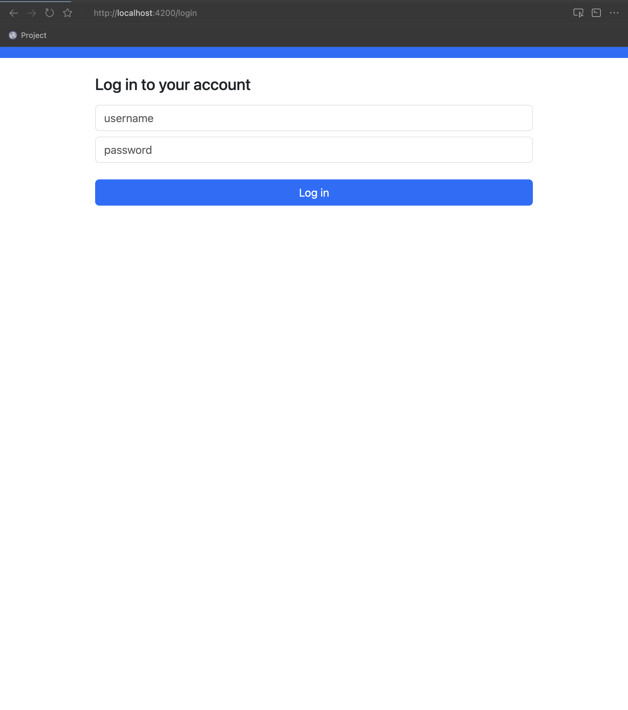
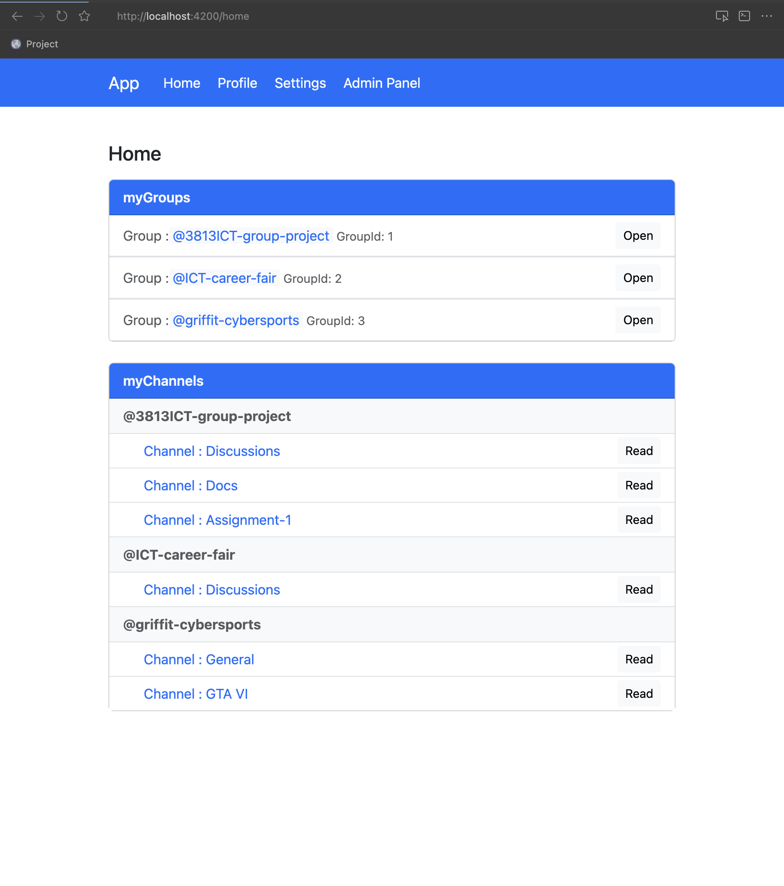
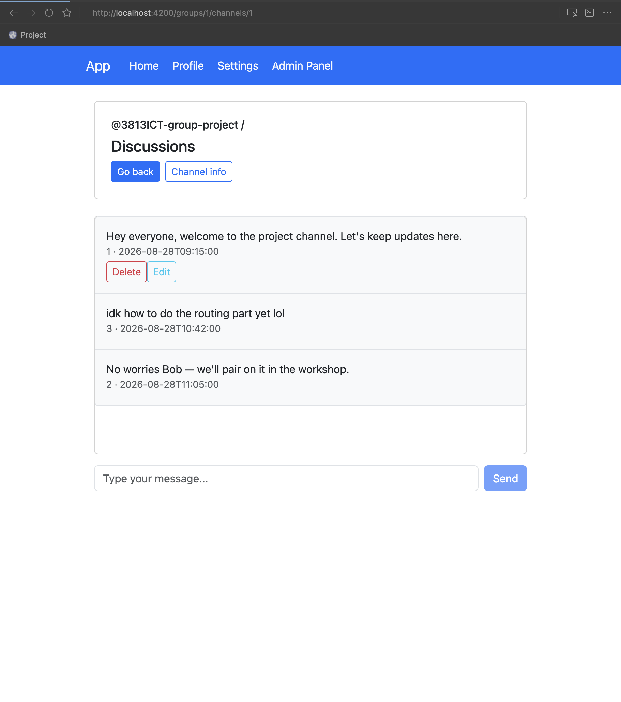
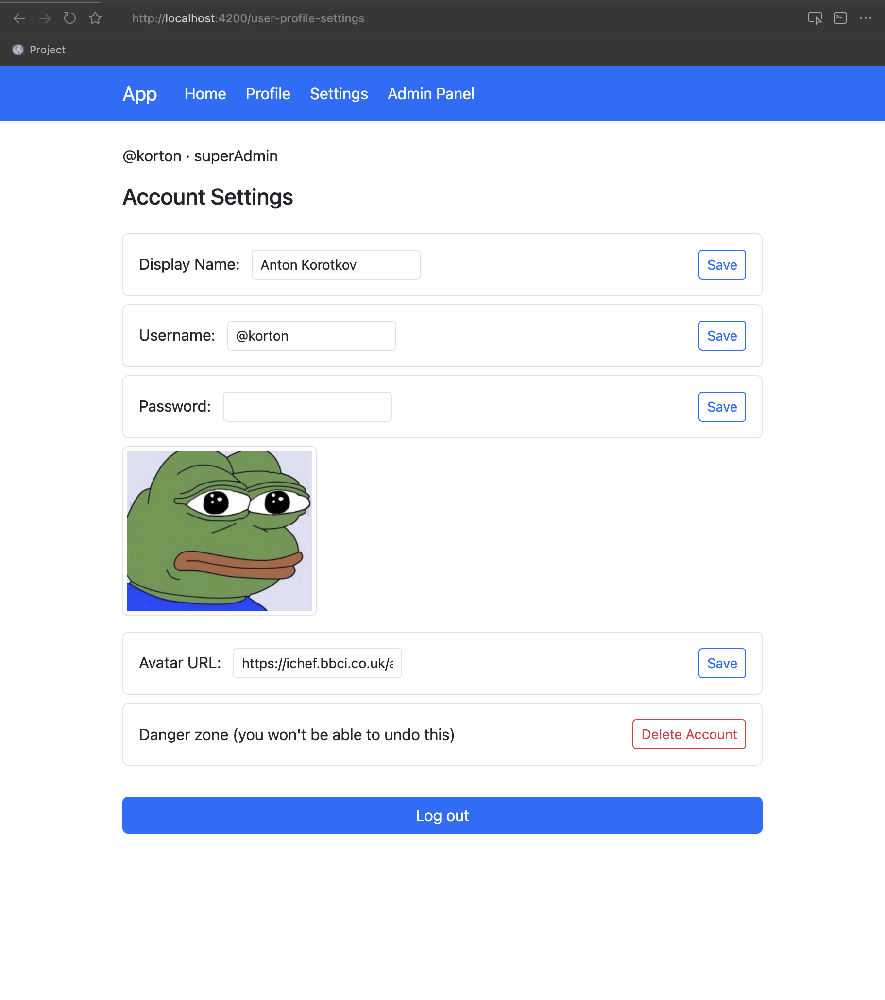
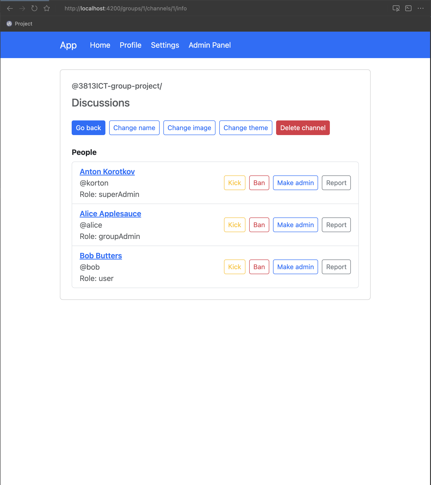
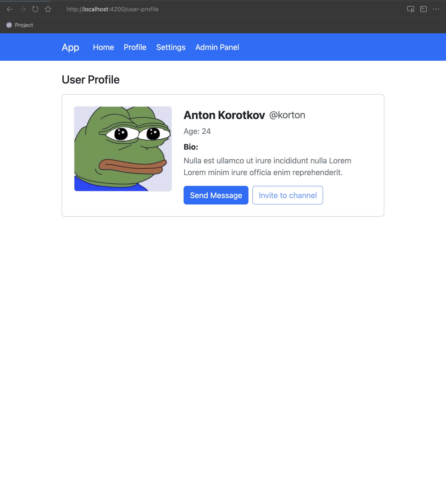
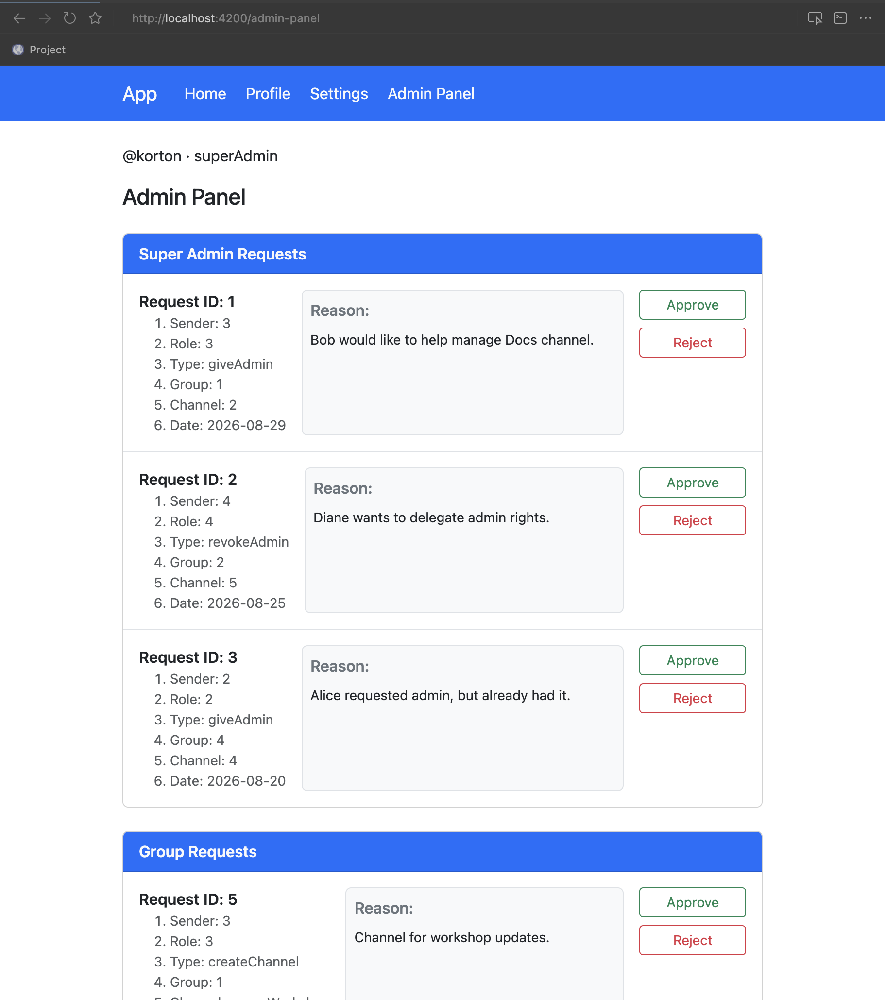

# 3813ICT Phase 1 Submission

**Name:** Anton Korotkov  
**Student number:** s5343594  
**GitHub:** [https://github.com/Yskrim/3813ICT-Assignment-5343594](https://github.com/Yskrim/3813ICT-Assignment-5343594)  

# Phase 1 — Specification, Design & Prototype

3813ICT Full Stack Development  assignment phase1 by Anton Korotkov s5343594 (Wednesday 1pm class)  

## GitHub repo: [https://github.com/Yskrim/3813ICT-Assignment-5343594](https://github.com/Yskrim/3813ICT-Assignment-5343594)

## 1. Project Overview

This project is a full-stack chat application built for the 3813ICT assignment. 
The system allows users to communicate in group channels with role-based access control.

### Hierarchy

- **Group** — a community with a name and members
- **Channel** — a chat room inside a group
- **Message** — text messages inside a channel (mock data in Phase 1)


### User roles


| Role         | Description                                                            |
| ------------ | ---------------------------------------------------------------------- |
| `user`       | Member of groups/channels; can send messages, request channel creation |
| `groupAdmin` | Manages their groups; approves group-scoped admin requests             |
| `superAdmin` | Approves super-scoped requests (ban, giveAdmin, deleteGroup, etc.)     |


### Phase 1 scope

- Angular frontend prototype with UI for all permission levels
- Basic username/password authentication (mock users)
- In-memory mock data for messages and admin workflows
- Route guards for auth and role-based access
- Admin panel with approve/reject flow; `createChannel` approval creates a new channel
- **Planned / in progress:** persistent JSON storage on Node/Express server for users, groups, and channels


### Out of scope (Phase 2)

- Real-time messaging via Socket.io
- MongoDB persistence
- Full session-based message history (last-5 buffer, wipe on leave)
- Direct messages (DM)

---


## 2. Git Strategy


| Practice             | Description                                                                   |
| -------------------- | ----------------------------------------------------------------------------- |
| **Main branch**      | `main` — stable, submission-ready code                                        |
| **Feature branches** | Short-lived branches per feature (e.g. `feature/auth`, `feature/admin-panel`) |
| **Commits**          | Small, focused commits with clear messages describing *why*                   |
| **Pull requests**    | Optional self-review before merging to `main`                                 |
| **Tags**             | Tag `phase1-submission` at final submission commit                            |


### Example workflow

1. Create branch from `main`
2. Implement feature and test locally (`ng serve`)
3. Commit and merge back to `main`
4. Push before submission deadline (no pushes after deadline are marked)

---


## 3. Specifications & Assumptions


### Functional requirements (from client briefing)


| Requirement                                | Phase 1 status                                            |
| ------------------------------------------ | --------------------------------------------------------- |
| Login with username/password               | Implemented (mock seed users)                             |
| UI per role (user, groupAdmin, superAdmin) | Implemented                                               |
| Group → Channel hierarchy                  | Implemented                                               |
| Create channel via admin request + approve | Partially (approve creates channel; user request UI TODO) |
| Send messages in channel                   | Mock (in-memory)                                          |
| Delete own messages in session             | Implemented                                               |
| Edit own messages in session               | TODO                                                      |
| One room at a time                         | Documented; full logic in Phase 2                         |
| Transient messages (last 5 on server)      | Phase 2 (Socket.io)                                       |
| Users/Groups/Channels in server JSON       | Planned                                                   |
| No unread badges / quote replies           | By design                                                 |
| Kick / ban / delete group                  | UI placeholders; approve logic partial                    |


### Permissions matrix


| Action                        | User | Group Admin                  | Super Admin               |
| ----------------------------- | ---- | ---------------------------- | ------------------------- |
| Send messages                 | Yes  | Yes                          | Yes                       |
| Delete own messages (session) | Yes  | Yes                          | Yes                       |
| Request create channel        | Yes  | Yes (request + self approve) | Yes (can approve)         |
| Approve group requests        | No   | Yes (own groups)             | Yes (if also group admin) |
| Approve super requests        | No   | No                           | Yes                       |
| Kick user from group          | No   | Yes (UI placeholder)         | Yes (if also group admin) |
| Ban user (all groups)         | No   | No                           | Yes (UI placeholder)      |
| Edit group (name/image/theme) | No   | Yes (UI placeholder)         | Yes (if also group admin) |
| Delete own account            | Yes  | No while admin               | No                        |


### Assumptions

1. Authentication
  — Phase 1 uses plain-text passwords in mock seed data; hashing on server in Phase 2.
2. Messages
  — Stored in-memory in Angular seed; not persisted after page refresh.
3. Channel IDs
  — String identifiers (e.g. `'1'`, `'2'`) linked to messages via `chatId`.
4. Super admin
  - can also be a group admin
    - they see both super requests and group requests for managed groups.
5. Group names are unique
  - (forced in Phase 2 server-side).
6. No admin-only channels
  — all channels are visible to group members.
7. Images in messages
  — model supports `imageUrl`; UI not implemented in Phase 1.
8. Create channel
  — regular users and group admins submit a request;
  - a group admin (or super admin acting as group admin) approves it.

---


## 4. Data Structures


### User

```ts
interface User {
    id: string;
    username: string;
    password: string;
    role: "user" | "groupAdmin" | "superAdmin";
    displayName: string;
    avatarUrl?: string;
    groupIds: string[];
    dateOfBirth: Date;
}
```


### Group

```ts
interface Group {
    id: string;
    name: string;
    adminIds: string[];
    memberIds: string[];
}
```

fields to add : `description`, `imageUrl`, `themeColor`

### Channel

```ts
interface Channel {
    id: string;
    name: string;
    groupId: string;
    adminIds: string[];
    memberIds: string[];
}
```


### Message

```ts
interface Message {
    id: string;
    chatId: string; // channel id
    senderId: string;
    text: string;
    imageUrl?: string;
    createdAt: Date | string;
    isEdited: boolean;
}
```


### AdminRequest

```ts
type AdminRequestType =
    | "banUser"
    | "deleteGroup"
    | "createGroup"
    | "deleteChannel"
    | "deleteAccount"
    | "kickUser"
    | "giveAdmin"
    | "revokeAdmin"
    | "createChannel";

type AdminRequestScope = "super" | "group";

interface AdminRequest {
    id: string;
    type: AdminRequestType;
    issuerId: string;
    targetUserId?: string;
    targetGroupId?: string;
    targetChannelId?: string;
    proposedChannelName?: string;
    note: string;
    status: "pending" | "approved" | "rejected";
    createdAt: Date;
    reviewedBy: string | null;
    reviewedAt: Date | null;
}
```

Group-scoped types: `kickUser`, `deleteChannel`, `createChannel`.  
Super-scoped types: `banUser`, `deleteGroup`, `createGroup`, `deleteAccount`, `giveAdmin`, `revokeAdmin`.

### Storage


| Data                    | Phase 1                        | Phase 2                          |
| ----------------------- | ------------------------------ | -------------------------------- |
| Users, Groups, Channels | server JSON                    | MongoDB                          |
| Messages                | In-memory mock                 | Socket.io + server last-5 buffer |
| Admin requests          | Server json                    | Server JSON / DB                 |
| Auth session            | Angular signal + localstrorage | JWT / server session             |


---


## 5.  Architecture


### Pages & routes


| Page             | Route                             | Guard                                                 |
| ---------------- | --------------------------------- | ----------------------------------------------------- |
| Login            | `/login`                          | `guestGuard`                                          |
| Home             | `/home`                           | `authGuard`                                           |
| Group            | `/groups/:gId`                    | `authGuard`                                           |
| Channel          | `/groups/:gId/channels/:cId`      | `authGuard`                                           |
| Channel Info     | `/groups/:gId/channels/:cId/info` | `authGuard`                                           |
| Group Info       | `/groups/:gId/info`               | `authGuard`                                           |
| User Profile     | `/user-profile`                   | `authGuard`                                           |
| Account Settings | `/user-profile-settings`          | `authGuard`                                           |
| Admin Panel      | `/admin-panel`                    | `authGuard` + `roleGuard('groupAdmin', 'superAdmin')` |


### Services


| Service               | Responsibility                          |
| --------------------- | --------------------------------------- |
| `AuthService`         | Login/logout, `currentUser` signal      |
| `UserService`         | CRUD users, get members by ids          |
| `GroupService`        | Get groups by id / for user             |
| `ChannelService`      | Get channels, create from admin request |
| `MessageService`      | Get/send/delete messages (mock)         |
| `AdminRequestService` | Panel view, approve/reject requests     |
| `UtilsService`        | Date formatting                         |


---


## 6. Server Endpoints

URL: `http://localhost:3000/api`  
Stack: Node.js + Express + Cors + socket.io

### Authentication


| Method | Endpoint       | Description                               |
| ------ | -------------- | ----------------------------------------- |
| POST   | `/auth/login`  | Validate credentials, return user session |
| POST   | `/auth/logout` | End session                               |


### Users


| Method | Endpoint     | Description            |
| ------ | ------------ | ---------------------- |
| GET    | `/users`     | List all users (admin) |
| GET    | `/users/:id` | Get user by id         |
| POST   | `/users`     | Create user            |
| PUT    | `/users/:id` | Update user profile    |
| DELETE | `/users/:id` | Delete account         |


### Groups


| Method | Endpoint      | Description                        |
| ------ | ------------- | ---------------------------------- |
| GET    | `/groups`     | List groups for current user       |
| GET    | `/groups/:id` | Get group by id                    |
| POST   | `/groups`     | Create group                       |
| PUT    | `/groups/:id` | Update group (name, image, theme)  |
| DELETE | `/groups/:id` | Delete group (super admin request) |


### Channels


| Method | Endpoint                | Description            |
| ------ | ----------------------- | ---------------------- |
| GET    | `/groups/:gId/channels` | List channels in group |
| GET    | `/channels/:id`         | Get channel by id      |
| POST   | `/groups/:gId/channels` | Create channel         |
| PUT    | `/channels/:id`         | Update channel         |
| DELETE | `/channels/:id`         | Delete channel         |


### Admin Requests


| Method | Endpoint              | Description                              |
| ------ | --------------------- | ---------------------------------------- |
| GET    | `/admin-requests`     | List pending requests (filtered by role) |
| POST   | `/admin-requests`     | Submit new request                       |
| PATCH  | `/admin-requests/:id` | Approve or reject                        |


### Messages (Phase 2 — Socket.io) - what the final version of the project would include


| Event           | Description                        |
| --------------- | ---------------------------------- |
| `joinChannel`   | Join room, receive last 5 messages |
| `leaveChannel`  | Leave room, wipe local history     |
| `sendMessage`   | Broadcast new message              |
| `deleteMessage` | Broadcast message deletion         |
| `editMessage`   | Broadcast message edit             |


### Phase 1 server that I have got now

- Express + CORS + Socket.io skeleton exists in `/server`
- REST endpoints and JSON file persistence: mostly done
  - server has own route endpoints
  - server-side requests mutate data in the stored json files

---


## 7. Design

- Mobile-first layout using Bootstrap 5 grid and utilities
- Navbar shown only when user is logged in
- Admin request cards stack vertically on mobile flex-column flex-md-row
- Channel message list scrolls within fixed height max-height: 60vh
- Max content width w-75 container for readability on desktop


### Storyboards











| Screen       | Description                                           |
| ------------ | ----------------------------------------------------- |
| Login        | Username + password form                              |
| Home         | List of user's groups and nested channels             |
| Channel      | Group/channel header, message list, send form         |
| Group Info   | Members list, admin action buttons                    |
| Channel Info | Channel members                                       |
| User Profile | Display name, avatar, age                             |
| Settings     | Edit profile fields, delete account                   |
| Admin Panel  | Super/group requests with approve/reject; groups list |


### UI colour scheme
- Primary navbar: Bootstrap `bg-primary`
- Cards with `card-header` for section titles
- Admin Panel link visible only for `groupAdmin` / `superAdmin`


### Component diagram
See `Project Component Structure.png` in the repository root.

---


## 8. Test Accounts (Phase 1 mock)
| Username   | Password | Role                                       |
| ---------- | -------- | ------------------------------------------ |
| `@korton`  | `123`    | superAdmin (also group admin of group `1`) |
| `@alice`   | `123`    | groupAdmin                                 |
| `@bob`     | `123`    | user                                       |
| `@charlie` | `123`    | groupAdmin                                 |


---


## 9. Known Limitations (Phase 1)
1. User session lost on page refresh (no persistent auth token)
2. Messages and admin request changes are in-memory only
3. Server JSON API not yet connected to Angular services
4. Several admin action buttons are UI placeholders only
5. Create channel request form not yet implemented for regular users
6. Message edit not implemented
7. Group model missing `image`, `description`, `themeColor` fields
8. Approve logic only fully handles `createChannel`; `kickUser` and `deleteChannel` are pending

---


## 10. Phase 2 Roadmap
- MongoDB
- REST API implementation
- Socket.io real-time messaging
- Session-based message rules (last 5, wipe on leave)
- Password hashing + bcrypt
- Image upload for messages and group avatars
- Direct messages -to be discussed

